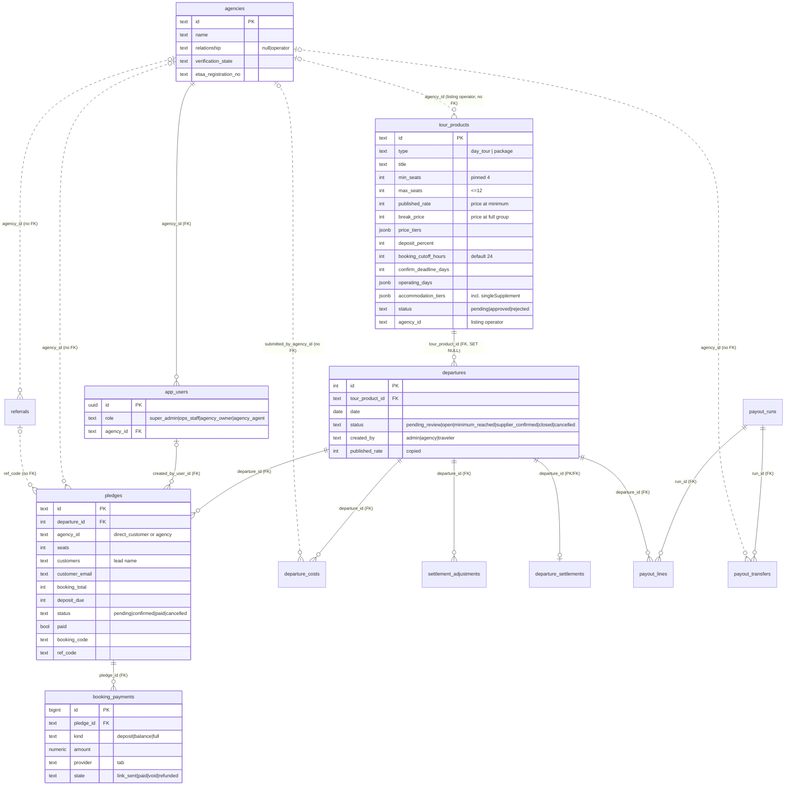

# 01 · How Sawa works today (as built)

Audit of branch `claude/wizardly-keller-z7x7op` at `0f97967`, 26 Sep 2026. That is `main` plus two unmerged commits: copy/spelling fixes and a tours CSV export. Neither touches the model.

This was read-only. Nothing was run against a database, a payment provider or a mail service. "Not found" means searched for and not found. Paths are relative to the repo root.

**Inputs checked:**
- `sawa-rate-card.xlsx`: two uploads with identical contents; no real figures yet.
- *Sawa Operator Supply & Agency Reseller Agreements (draft, 26 Sep 2026)*.

The agreements describe the target, so they are used in 02 and 03, not here. For their requirements, searched and **not found** in the code:
- complaints handling;
- on-time pickup tracking;
- traveller nationality;
- per-traveller pickup point;
- programmatic WhatsApp messages;
- operator documents (licence and insurance copies);
- any split-payment capability.

**The production database was not reachable from this audit.** Counts in §7 come from the repo (fixtures, and dated notes in `docs/audit/`) plus one admin screenshot supplied on 26 Sep. They are not a live query.

---

## 1. Stack and structure

| Layer | As built | Where |
|---|---|---|
| Runtime | Node ≥ 22, one package, ES modules | `package.json` |
| Server | Express 5, one file for the API and page serving (~4,200 lines) | `server/app.js` |
| Validation / security | zod 4, helmet, express-rate-limit, sanitize-html; CSP report-only unless `CSP_ENFORCE` | `package.json`, `server/csp.js:110` |
| Front end | React 19 SPA built with Vite 7: public tour pages, booking, widget, admin portal and agency portal. Hand-written static HTML for marketing and legal pages | `src/main.jsx`, `src/AdminDashboard.jsx`, `src/AgencyDashboard.jsx`, `site/*.html` |
| Shared rules | Isomorphic modules used by server and browser: group size, booking policy, pricing, payment window, currency (EUR), operating days, departure state | `shared/*.js`, `shared/group-size.js:24,30`, `shared/currency.js:34` |
| Database | PostgreSQL on Supabase via `pg.Pool` on `DATABASE_URL`. RLS on with no policies, and the Data API is locked down (`schema_024`). The server connects as table owner | `server/db/index.js:7-20`, `server/db/schema_024_lock_down_data_api.sql:66-105` |
| Migrations | 46 files in `server/db/schema*.sql`, run **by hand** (`npm run db:migrate`), not on deploy. Only 041 is applied on `npm start` | `server/db/migrate.js:11-58`, `docs/RUNBOOK.md:545-564`, `server/db/apply-deploy-data-fixes.js` |
| Auth | Supabase Auth JWT → `app_users` row with one of 4 roles | `server/auth.js:29-66`, `server/db/schema_002_auth.sql:7-23` |
| Hosting | Railway (Nixpacks); build `npm run build`, start `npm start`, health check `/api/health`. No Railway cron | `railway.json` |
| Background jobs | In-process scheduler, on in production. Three of its jobs are **dry by default** (see below) | `server/jobs/scheduler.js:37-70, 114-141, 311-318` |
| Payments | **No gateway integration.** Ops make links by hand in Tab (tab.travel), paste them into the portal, and mark them paid with Tab's reference | `server/payments.js:1-17`, `schema_043_booking_payments.sql:9-17` |
| Email | Resend HTTP API when `RESEND_API_KEY` is set, otherwise log only. Outbox with retries (`email_log`, schema_042) | `server/email.js:19-36, 62-151, 175-222` |
| WhatsApp / SMS | No messaging integration. Twilio Verify for phone one-time codes only, off unless configured. WhatsApp appears only as a contact link | `server/phone-verify.js:1-23`, `server/brand.js:32` |
| Storage | Supabase Storage: public `tour-images` bucket; private `cost-receipts` bucket with signed URLs | `server/app.js:3710-3731`, `server/receipts.js:16` |
| External sync | Autoura: signed webhook mirror of each departure out, and blackout dates in. Off unless configured | `server/autoura-sync.js:1-51, 138-144, 280-290` |

**Scheduled jobs** (`server/jobs/scheduler.js`):

| Job | What it does | Cadence | Live? |
|---|---|---|---|
| cancel-unconfirmed | Cancels `open` dates that missed the confirm deadline and lapses unanswered date requests. Emails travellers | +60 s, then every 24 h | Dry unless `CANCEL_JOB_DRY_RUN=0` (`:43-70`) |
| goahead-alert | Emails ops "GoAhead — payment link needed" | hourly | Dry unless `GOAHEAD_ALERT_DRY_RUN=0` (`:114-129`) |
| goahead-notify | Emails travellers that their date is confirmed | hourly | Dry unless `GOAHEAD_NOTIFY_DRY_RUN=0` (`:126-141`) |
| email-retry | Retries failed outbox rows | every 15 min | Always (no-op in log mode) |
| audit-watch | Read-only claims audit of the public site, schema check, seed expiry | every 24 h | Always |

The actual production values of the dry-run flags are not in the repo.

---

## 2. Data model

Final state after migrations 001–046. "(no FK)" means the column holds an id with no declared constraint. Every table has RLS on with no policies.

### Products, departures, bookings

**`tour_products`**: the catalogue *and* agency-submitted listings.
- Base columns (`schema.sql:34-60`): `id` PK, `title`, `city`, `cities` JSONB (packages), `nights`, `duration`, `default_time`, `guide`, `vehicle`, `description`, `included`, `not_included`, `itinerary` (JSONB day list), `accommodation_tiers` (JSONB with `perPersonSupplement` and `singleSupplement`).
- `type`: CHECK `day_tour` | `package`.
- Pricing: `published_rate` INT >0 (price per person at the GoAhead minimum), `break_price` INT (price at a full group; CHECK ≤ published), `base_cost` INT (stored, used in no calculation), `quality` NUMERIC(2,1) (default 4.7), `deposit_percent` 0–100.
- Group size: `min_seats` (CHECK ≥4 in 022, pinned =4 in 027), `max_seats` (≤12 in 021).
- 005: `active`.
- 006: `overview_html`, `policies_html`, `what_to_bring`, `meeting_point`, `pickup_note`, `booking_cutoff_hours` (default 24), `images`.
- 008: `meeting_points`.
- 013: `status` pending | approved | rejected; `agency_id` (no FK; the listing's operator); `submitted_by`/`_at`, `reviewed_by`/`_at`, `rejection_reason`.
- 015: `operating_days` (weekday ints).
- 018: `updated_at`, with a trigger.
- 019: `confirm_deadline_days` (0–365; NULL means type default).
- 020: `price_tiers` JSONB `[{seats, price}]`.
- 037: `request_min_lead_days`, `request_max_horizon_days`.
- 038: `booking_cutoff_unit` (hours | days).
- Mapper: `server/db/mappers.js:55-113`.

**`departures`**: a product on a date (`schema.sql:64-97`).
- `id` INT, assigned from `departures_id_seq` by code (not a column default).
- `tour_product_id` FK → tour_products (ON DELETE SET NULL).
- `type`, `route`, `date`, `start_date`, `end_date`, `nights`, `cities`, `time`, `city`, `guide`, `vehicle`, `notes`.
- A **copy** of the pricing fields: `min_seats`, `max_seats`, `base_cost`, `published_rate`, `break_price`, `quality`, `deposit_percent`.
- `status` CHECK: `pending_review` | `open` | `minimum_reached` | `supplier_confirmed` | `closed` | `cancelled` (014).
- `created_by` admin | agency | traveler (014).
- **No operator column.** The operator is computed on every read (§4.4).
- Mapper: `mappers.js:147-176`.

**`pledges`**: bookings (`schema.sql:101-123`, plus 002, 004, 007, 011, 016, 023, 028, 030).
- Keys: `id` PK; `departure_id` FK (CASCADE); `agency_id` (no FK; `'direct_customer'` for public bookings); `agency` (display name).
- Traveller data, stored on the booking: `seats`, `customers` (lead name as free text), `customer_email`, `customer_phone`, `traveller_names` JSONB (never written).
- Price captured at booking: `price_per_person`, `booking_total`, `deposit_percent`, `deposit_due`, `balance_due`, `balance_due_date`.
- Status and source: `status` pending | confirmed | paid | cancelled; `paid` BOOL (030); `source` public | agency | admin | public_request | agency_request.
- Other: `booking_code` (unique on upper case, 016; not issued for agency bookings), `rooming_type`, `accommodation_tier`/`_name`, `ref_code`, `created_by_user_id` FK → app_users.
- **Unwritten columns:** 023 (`cancelled_reason`, attribution, marketing consent, `lawful_basis`) and 028 (per-pledge payment window). 043 says 028 is superseded (`schema_043…:22-27`).

**Travellers:** no table. Traveller data lives on the pledge row.

**Date requests:** no table. A request is a `departures` row in `pending_review` plus a seed `pledges` row in `pending` with source `*_request` (`server/app.js:1788-1840`).

### Payments and refunds

**`booking_payments`** (043, `schema_043_booking_payments.sql:32-101`): one row per manually sent link.
- Columns: `pledge_id` FK (CASCADE), `amount` NUMERIC(10,2), `currency` (default EUR), `provider` (default `'tab'`), `link_url`, `link_sent_at`, `due_at`, `emailed_to`, `created_by`.
- `kind` deposit | balance | full; `due_bound_by` window | confirm-deadline | balance-due-date | minimum.
- `state` link_sent | paid | void | refunded, with `paid_at`, `provider_reference`, `voided_at`, `void_reason`, `refunded_at`, `refund_reference`.
- CHECKs tie each state to its timestamps. A unique partial index allows one open link per (pledge, kind).
- **Refunds are a state on this table; there is no refunds table.**

### Settlement and payouts (044–046, `schema_044_settlements.sql`)

- **`departure_costs`**: cost or income lines per departure. `category` (10 cost + 3 income categories, 046), `kind` cost | income, `basis` group | person with `unit_amount` × `quantity` (045), `amount`, `receipt_url`, `submitted_by_agency_id` (NULL = Sawa), `state` submitted | approved | rejected, `approved_amount`.
- **`settlement_adjustments`**: signed amount per party (`agency_id` NULL = Sawa), with a reason.
- **`departure_settlements`**: sign-off record per departure (`costs_final_at`, `loss_decided_at`, `loss_note`).
- **`payout_runs`**: one per Wednesday `pay_date` (unique), state draft | approved.
- **`payout_lines`**: amount owed to each agency, per run and departure.
- **`payout_transfers`**: one per (run, agency), state due | paid with `bank_reference`.

### Operators, agencies, users, verification

**`agencies`**: operators **and** agencies in one table (`schema.sql:24-30`).
- Base: `id`, `name`, `contact_name`, `phone`, `status` (no CHECK; never enforced).
- 025, the verification record: `tourism_license_no`, `etaa_registration_no`, `insurance_insurer`, `insurance_policy_no`, `insurance_expires`, `track_record`, `verified_at`, `verified_by`, `verification_state` NULL | verified | rejected | lapsed, `verification_evidence`.
- 035: `tourism_license_year` (replacing `_expires`).
- 029/036: `relationship` NULL | operator.
- **No bank or payout-account columns** (deliberate; `schema_025…:35-41`).

**`app_users`** (`schema_002_auth.sql:7-26`):
- `id` = Supabase user id; `email`, `full_name`.
- `role` super_admin | ops_staff | agency_owner | agency_agent.
- `agency_id` FK → agencies (CASCADE); required for agency roles, forbidden for platform roles.
- `status` active | disabled.

**`operator_applications`** (017): `reference`, company, contact, city, email, phone, `licence`, regions, about, `status` new | in_review | approved | rejected. Written by the public form; **no route or screen reads it** (`server/app.js:1456-1475`).

### Attribution, commission, messaging, audit

- **`referrals`** (011/012): `code` PK, `name`, `commission_percent` (report only), `visits`, `active`, `agency_id` (no FK). Linked to `pledges.ref_code` (no FK).
- **`route_alerts`** (026): consent-gated marketing list. **Nothing writes to it** (`schema_026…:37-47`).
- **`email_log`** (003/042): outbox with html, text, attempts, `next_attempt_at`; `status` pending | sent | failed | logged | aborted (no CHECK).
- **`audit_log`** (003/024): append-only (UPDATE/DELETE/TRUNCATE triggers raise). It is also the event store for the GoAhead queues (`departure.goahead`, `.goahead_alert`, `.goahead_notified`).

**Not found:** tables for ratings or reviews (the absence is stated in `schema_025…:104-107`), documents (apart from `departure_costs.receipt_url` and the `verification_evidence` text), rosters, rate cards, commissions (beyond `referrals.commission_percent`), invoices, add-ons, and traveller safety needs.

### Entity-relationship diagram

Solid lines are declared foreign keys; dotted lines are ids held with no constraint.

---

## 3. Roles and permissions

Only four roles exist (`schema_002_auth.sql:11-12`). They are enforced by `requireAuth` / `requireRole` (`server/auth.js:51-63`). `requireAdmin` means super_admin only (`server/app.js:2277-2279`).

| User type | Exists as | Can create | Can see | Can change |
|---|---|---|---|---|
| Traveller | **No account.** Anonymous; the booking code is the credential (`app.js:304-321`) | Bookings on open dates (`app.js:1294`); date requests (`1846`); operator applications (`1456`) | Public catalogue with other bookings reduced to seats and status (`app.js:220-225`); own booking by code (`1477`) | Cancel own booking before GoAhead (`1593`) |
| Operator | **Not a role.** An operator is an `agencies` row (§4.4, `schema_029/036`) | (same as agency) | (same as agency) | (same as agency) |
| agency_agent | Role | Listings (go to pending, `app.js:1018`); bookings for own clients (`1185`); date requests (`1878`); cost lines on dates it operates (`3396`); receipts; images (`3710`) | Approved catalogue plus own listings in any status; full detail only on own bookings (`220-246`); `departures.notes` on every date (`250-252`); own payments (`3092`); own settlement share (`3601`) | Cancel own bookings before GoAhead (`1394`); edit own listings (sends them back to pending) |
| agency_owner | Role | As agent, plus team logins (`2384`) | As agent, plus team | Agency contact name and phone (`549`); team role and status (`2399`) |
| ops_staff | Role ("Operations") | Departures (with a first traveller, `732`); listings (auto-approved, `995`); payment links (`2977`); cost lines, adjustments, payout runs (`3385-3566`); blog, destinations, referrals | Everything, including all traveller personal data (`2819-2851`) and the audit log | Approve or reject listings and date requests; reprice (`1105`); confirm or cancel departures (`1147`, `3648`); booking status (`2854`); mark payments paid or refunded (`3041-3088`); approve and pay payout runs (`3568-3597`) |
| super_admin | Role | As ops_staff, plus agencies with owner login (`2545`) and platform staff (`2503`) | Everything | As ops_staff, plus the verification record (`2636`), staff roles, deleting agencies (`2692`) |
| Auditor | Not a role; a read-only DB connection for audit scripts | — | Read only | — |

Notes:
- There is no maker/checker on money. ops_staff can approve and pay a payout run alone.
- `agencies.status` is never checked for access. A "disabled" agency's users keep full access (only a count at `app.js:2774`).
- **Authorization defect found during this audit.** `POST /api/agency/tour-products` lets any agency user overwrite a Sawa-owned product and take it over:
  - Ownership is refused only when the existing `agency_id` is non-NULL and different (`app.js:1023-1028`).
  - The upsert then sets `agency_id = COALESCE(EXCLUDED.agency_id, …)` (`app.js:965`), assigning the product to the caller.
  - Every catalogue product has `agency_id` NULL, and product ids are public.
  - Read in code, not exercised. See the README.

---

## 4. Flows as built

### 4.1 How products and departures come into existence

**Products.** There are two paths into `tour_products`, both through `upsertTourProduct` (`server/app.js:859-991`):
- **Admin create/edit:** `POST /api/admin/tour-products` (`995-1013`). Auto-approved; can set the "Operating company" (`agency_id`).
- **Agency or operator submission:** `POST /api/agency/tour-products` (`1018-1039`). Always `pending`, and `agency_id` comes from the session. Ops approve (`1067-1082`) or reject (`1085-1102`), which emails the owner. An edit to a live listing sends it back to pending.
- **Seed scripts:** `server/db/add-package*.js`, `seed.js`, and migration 041 (`apply-deploy-data-fixes.js`).
- `confirm_deadline_days` is not in the upsert (`app.js:929-937`). It can only be changed in the database.

**Departures. There is no calendar or generator.** Dates come into existence in four ways:
1. **Admin, only with a first traveller.** `POST /api/admin/departures` (`app.js:732-850`) creates an `open` date and a first booking in one transaction. It refuses a date without `firstTraveler` (`734-753`) and checks operating days (`768-769`). Its rationale is "a date is created by its first booking".
2. **Traveller "start your own date".** `POST /api/public/departure-requests` (`1846-1872` → `createDateRequest` `1710-1844`) creates a `pending_review` date plus a pending seed booking. Checks:
   - phone verification if configured;
   - Autoura blackout dates;
   - request window (3 days' lead, 90-day horizon, `shared/request-window.js`);
   - operating days;
   - "join first": returns 409 if an open date exists within ±3 days (`414`, `1763-1779`).
3. **Agency request.** `POST /api/agency/departure-requests` (`1878-1901`), same helper, `created_by='agency'`.
4. **Admin approves or declines a request** (`1926-1960`, `1987-2011`). Approval does **not** call `refreshStatus`, so a request that already holds ≥4 seats never enters the GoAhead queues (`1942-1945`).

Other departure sources:
- `server/db/set-package-dates.js:1-49`: a manual script that deletes all of a product's departures and inserts empty ones on fixed dates. Not wired to any route or job.
- `operating_days` (015) only *restricts* which weekdays can be requested; it creates nothing.

### 4.2 How a traveller books

- **Route:** `POST /api/public/departures/:id/bookings` (`app.js:1294-1353`). No auth, rate-limited.
- **Guards:**
  - one live booking per verified phone per date;
  - the date is not cancelled or pending review;
  - capacity: `seatsTotal + seats ≤ maxSeats`;
  - cut-off: start (Cairo time) − `booking_cutoff_hours`, **default 24 h** (`server/domain.js:280-296`).
- **Stored on the pledge:**
  - lead name, email, optional phone, seats;
  - rooming type (single/double/triple) and hotel tier for packages;
  - `ref_code`;
  - the **price captured at booking** (`computePledgePricing`, `domain.js:299-327`): price per person at the projected headcount, total, deposit (**10% day tour / 25% package**, `shared/booking-policy.js:53-58`), balance, balance due date (**2 days / 14 days** before, `booking-policy.js:65-86`).
- **Not captured:**
  - individual traveller names (`traveller_names` is never written);
  - any safety, dietary, medical, mobility or special-request field (not found in any schema, route or form);
  - add-ons (not found).
- **Charged: nothing, and no card is collected** (`site/terms.html:225`). Money is requested only after GoAhead, by manual Tab link (§5).
- **Agency booking:** `POST /api/departures/:id/pledges` (`app.js:1185-1219`). Same checks at the retail price, with **no booking code and no confirmation email to the customer**.

### 4.3 GoAhead: detection and triggers

- **Detection:** `refreshStatus` (`server/departure-status.js:14-51`) runs after every booking write. When non-cancelled seats ≥ `min_seats` (4) it writes `minimum_reached` and inserts an `audit_log` `departure.goahead` row in the same transaction (`goahead-alert.js:67-73`).
- **Sticky:** once reached, `minimum_reached` is never recomputed downward (`departure-status.js:20-28`; `shared/departure-state.js:68-95`), so the date runs even if bookings fall below 4. This is the guarantee as built.
- **Triggers** (all derived from the audit log):
  - **goahead-alert** (hourly; dry by default) emails ops "payment link needed" (`server/jobs/alert-goahead.js`). It names the *listing* agency, not the computed operator (`alert-goahead.js:31-34`).
  - **goahead-notify** (hourly; dry by default) emails every traveller "your date is confirmed" (`server/jobs/notify-goahead.js`).
  - The **payments queue** shows `deposit_link_needed` for the booking (`server/payments.js:133-166`).
  - **No charge, no operator notification and no assignment step.** `goAheadEmail` tells the traveller "your operator has been notified" (`server/email.js:698-700`); no such email exists.
- **Supplier confirmation:** a separate manual step (`POST /api/admin/departures/:id/confirm`, `app.js:1147-1182`) sets `supplier_confirmed` and emails travellers immediately. It has no guard on the current status, and the notify job can email the same travellers again.

**Auto-cancellation before GoAhead** (`server/jobs/cancel-unconfirmed.js`; rule `server/domain.js:216-259`):
- Deadline: **30 days before for packages, 7 days before for day tours**, overridable per product.
- An `open` date below the minimum after its deadline is cancelled and travellers are emailed.
- The job is dry by default in the scheduler.

### 4.4 How a departure is linked to an operator

**Never stored. It is recomputed on every read.** `operatorForDeparture` (`server/domain.js:520-597`, rule "U01", 26 Sep 2026):
1. **The company whose deposit-paid passengers fill the most seats runs the date.** If nobody has paid, all live bookings count.
2. **Passenger ownership** (`passengerOwner`, `domain.js:553-561`):
   - an agency's own booking counts for that agency;
   - a direct booking carrying an agency's widget `ref_code` counts for that agency;
   - any other direct booking counts for `DIRECT_BOOKINGS_OPERATOR`, default **"Capital Travel Service"**, matched by name (`server/brand.js:170-174`; `domain.js:602-607`).
3. Ties go to the date's creator, then the earliest booker.
4. The result is frozen at the booking cut-off.

**Where the rule is used:** tour page ("run by the partner with the most confirmed travelers … so this can change", `src/main.jsx:1845`), booking and GoAhead emails (`server/email.js:495, 699`), and settlement (only the computed operator may submit costs, `app.js:3403-3404`).

**Where it is not used:** the GoAhead alert and queue use `tour_products.agency_id` (`app.js:1977-1979`); the SEO tour page uses the product's agency (`server/seo.js:196-207`).

**Not found:** roster, assignment record, acknowledgement, strikes, penalties, ratings.

### 4.5 Pricing

**Price per person falls as the group grows** (`livePriceFor`, `shared/pricing.js`):
- The line runs from `published_rate` at the minimum to `break_price` at a full group, or follows `price_tiers` if set.
- Packages add the tier's `perPersonSupplement` and a **`singleSupplement` for single rooming** (`server/domain.js:141-147`).
- Each booking freezes its price at the projected headcount when it is made. Nothing reprices earlier bookings.
- A duplicate implementation exists in `src/AgencyDashboard.jsx:37-46`.

**Who sets prices:**
- **Operators and agencies can**, in their listing submission: GoAhead price, break price, tiers, deposit % and cancellation text, in `ProductEditor` agency mode (`src/AdminDashboard.jsx:939-951`; `app.js:1018-1039`).
- **Sawa can override:** `POST /api/admin/tour-products/:id/pricing` (`app.js:1105-1144`) rewrites the product and every departure.
- In practice every live price was entered by Sawa (`docs/audit/open-directives.md:647-684`, DIR-21 unresolved).

**Margin, markup and commission:**
- **No markup or margin is applied** to the traveller price.
- **Sawa's income is 10% of each departure's gross profit** (`SAWA_SHARE`, `server/settlement.js:32`):
  - gross profit = collected revenue + approved extra income − approved costs;
  - the other 90% is split among agencies by paid headcount (`settlement.js:105-148`).
- `referrals.commission_percent` feeds a report only (`app.js:2040-2064`).
- `base_cost` is unused.

### 4.6 Agency and widget attribution

**Widget:**
- `?ref=CODE` is stored in `localStorage` for 30 days, only after functional-cookie consent (`src/main.jsx:2586-2625`).
- Embed forms pass `refCode` directly (`main.jsx:2847-2955`).
- The agency's code is auto-created by `GET /api/agency/widget` (`app.js:2066-2089`).

**At booking:**
- The pledge stays `agency_id='direct_customer'`, with `ref_code` set (`app.js:1310-1331`).
- An unknown code creates a bare referrals row.

**Attribution** is computed by `passengerOwner` (§4.4) and drives the operator rule and the settlement split.

**Not wired:** the attribution columns in 023. The tour-page date request does not forward `refCode`; the widget does.

### 4.7 Cancellations and refunds

**Traveller:** `POST /api/public/bookings/:code/cancel` (`app.js:1593-1652`).
- Allowed only before GoAhead (`domain.js:391-435`). Afterwards: "Email hello@sawa.tours".
- Marks the pledge cancelled. **No email to anyone.**

**Agency:** `POST /api/agency/bookings/:pledgeId/cancel` (`1394-1441`). Same boundary, own bookings only, no email.

**Admin:**
- Hard-delete a pledge (`1359-1379`), or change its status freely (`2854-2889`). No emails.
- Cancel a whole departure in any status (`3648-3704`), emailing all travellers.

**Cancellation tiers** (`shared/booking-policy.js:100-152`, rendered in `server/email.js:510-531` and `site/terms.html:228-275`). Every charge is a fraction of the deposit, "the most you can lose is your deposit":

| Product | Notice | Charge |
|---|---|---|
| Day tour | ≥ 48 h | none |
| Day tour | < 48 h or no-show | deposit (10%) |
| Package | ≥ 30 days | none |
| Package | 29–15 days | half the deposit (12.5%) |
| Package | ≤ 14 days or no-show | deposit (25%) |

**Refunds:**
- **No code computes a fee or a refund amount** ("Nothing computes with these yet", `booking-policy.js:98-99`).
- A refund is a manual record: `POST /api/admin/payments/:id/refund` needs Tab's refund reference (`app.js:3076-3088`). No email.
- `cancellationEmail` always says anything charged "is refunded in full" (`email.js:899`).

**Not implemented:** Terms §13.2 (`terms.html:273`) promises that a paid departure falling below its minimum because another payment failed is held and refunded if not refilled. No code does this.

### 4.8 Operator and agency payouts

Both exist as **one profit-share mechanism**, not as rate-card or commission payments (`server/settlement.js`; routes `app.js:3248-3635`; UI `src/AdminSettlements.jsx`, `src/AgencyMoney.jsx`).

**Per departure:**
- Costs are entered by Sawa (auto-approved) or by the computed operator (submitted for review, with receipts).
- Sawa signs off costs as final and records a loss decision if needed.
- **Sawa takes 10% of gross profit and 90% is shared by paid headcount.** Direct travellers count for Capital Travel Service.

**Payout runs:**
- Every Wednesday (manual), covering tours ended by the previous Saturday (Cairo time).
- Draft → approve → one transfer per agency → mark paid with a bank reference.
- No bank integration and no bank-detail fields.

**Gaps:**
- **No payout line reimburses the approved costs to the operator that incurred them.** Costs only reduce profit. How operators recover tour costs: not found.
- **No per-seat commission exists.**

### 4.9 Notifications by step

Delivered through Resend with an outbox and retries (`server/email.js:19-222`).

| Step | Email (email.js line) | Recipient |
|---|---|---|
| Public booking | `bookingConfirmationEmail` (483): names the operator, "can change" (495) | Traveller |
| Agency booking | none to the customer; `opsNewBookingEmail` (638) | Ops |
| Date request | `departureRequestReceivedEmail` (537); approved (555) / declined (572) | Traveller (public requests only) |
| GoAhead | `goAheadPaymentLinkEmail` (601) to ops; `goAheadEmail` (693) to travellers. Both jobs dry by default | Ops / travellers |
| Payment | `paymentLinkEmail` (737), `paymentReceivedEmail` (768) | Traveller (also agency customers) |
| Departure cancelled | `cancellationEmail` (892) | Travellers |
| Listing | `opsNewListingEmail` (663); approved (789) / rejected (803) | Ops / listing owner |
| Operator application | `operatorApplicationEmail` (863), receipt (874) | Sawa / applicant |
| Staff | `inviteEmail` (459) | New user |

**Missing:**
- confirmation email for agency bookings;
- any email on traveller or agency self-cancel, on refund, or on booking status change;
- **any email to an operator or agency at GoAhead or cancellation**.

### 4.10 Operator verification

**Public application:** `site/verify.html:102-116` → `operator_applications`, emailed to Sawa (`app.js:1456-1475`). No screen reads applications.

**Onboarding is manual:**
- super_admin creates the agency and its owner login (`app.js:2545-2587`).
- super_admin maintains the verification record (licence number and year, ETAA number, insurer, policy, expiry, track record, state, evidence) (`app.js:2617-2690`; `schema_025`, `schema_035`).
- `verified_at` is set by the server.

**What blocks an unverified operator: nothing.** `verification_state` is read only for display (`server/domain.js:609-634`; `server/seo.js:634, 669`; `src/main.jsx:1834, 3214`).
- It gates no booking, listing, date request or cost submission.
- Insurance expiry is never checked; no job lapses verification.
- The `/partners` page lists every agency row, verified or not (`seo.js:722-736`).

### 4.11 Merging and pooling across operators

**Pooling is the core of the build:**
- Every booking for a date is a pledge on the same `departure_id`, whether direct, admin or any agency.
- Capacity, GoAhead and price read the combined seat count (`shared/departure-state.js:52-57`).
- Other agencies' bookings are redacted to seats and status (`app.js:220-242`).
- "Join first" steers new requests onto a nearby existing date (±3 days).

**The operator of a pooled date is whoever brings the most paid passengers** (§4.4). Nothing merges two existing departures.

---

## 5. Payments specifically

| Question | Answer as built | Evidence |
|---|---|---|
| Saved card, or charged at booking? | **Neither.** No card is collected at booking. After GoAhead, ops send a Tab payment link per booking (deposit, then balance). The traveller pays on Tab's page; ops mark it paid by hand | `server/payments.js:1-17`; `app.js:2977-3060`; `site/terms.html:225` |
| Provider and API | Tab (tab.travel), **no API use**: "Nothing here talks to Tab". No SDK in `package.json`; no saved payment methods, off-session charges, holds or webhooks. Stripe, Paymob, PayPal, setup/payment intents: not found. Fawry appears only as an open question in docs | `server/payments.js:3-8, 17`; `docs/production-readiness/10-decisions-needed.md:10` |
| Who is the merchant | **Not recorded in code.** Comments say "into Sawa's own merchant account" (`schema_028…:19-21`; `shared/site-copy.js:26-28`, DIR-18), while DIR-22 says "Sawa collects payment on the operator's behalf" (unresolved, `open-directives.md:~690-700`) | as cited |
| Entity on receipts | Payment emails name no receiving entity. The only entity text is the email footer "Online Era, trading as Sawa Tours" (`email.js:447`). Terms promise the confirmation identifies the entity (`terms.html:225`); no template does. **No invoices are generated** | as cited |
| Money split, held or paid out | **Split:** yes, arithmetically (10% / 90% profit share, `settlement.js`). **Held** (escrow or authorisation): no code. **Paid out:** recorded only (payout transfers marked paid with a bank reference). No bank API | `server/settlement.js:105-185`; `app.js:3568-3597` |
| Refunds | Recorded only (Tab refund reference); no calculation | `app.js:3076-3088` |
| Currency | EUR everywhere. The rate card is USD (decision in `03`) | `shared/currency.js:34`; `schema_043:37` |

---

## 6. Public claims about the business model

Verbatim, grouped by theme. **C** = conflicts with the target model; **D** = needs detail or rework; **OK** = compatible. The full inventory runs to ~200 lines, and each source file has more instances of the same claims. These are the load-bearing ones. The SPA (`src/main.jsx`) has its **own older copies** of About, How it works, FAQ, Terms and Privacy (`pageFromPath`, `main.jsx:1224-1229`), shown after in-app navigation, so both copies need rewriting.

**The quote you gave is not in the repo.** "keep your brand, margin and guests" doesn't appear. The nearest wordings are `site/operators.html:7,12,87`, `site/index.html:780`, `site/how-it-works.html:427` and `site/about.html:144` (below).

### (a) Who sells / seller of record
| File:line | Claim | |
|---|---|---|
| `site/_partials/footer.html:45` (all pages) | "© 2026 Sawa Tours · Operated by Online Era · Registration 148500" | C |
| `site/terms.html:101` | "The Platform is operated by Online Era, registration number 148500, trading as Sawa Tours" | C |
| `site/terms.html:113` | "Sawa provides a platform that brings travelers together on shared departures and coordinates reservations, confirmation, communication and payment." | C |
| `site/terms.html:114` | "The Operating Partner responsible for a departure is identified on the departure page or in the booking confirmation." | D |
| `site/terms.html:337` | "Sawa is responsible for performing the booking and coordination services it promises… The Operating Partner is responsible for delivering the travel services" | C |
| `site/about.html:138` | "We're a marketplace, but what we really sell is certainty" | C |
| `site/faq.html:80`; `site/goahead-promise.html:200` | "Sawa coordinates the group and your payment; the operator delivers the experience." | C |
| `site/privacy.html:89, 105-106` | Controller "Online Era, trading as Sawa Tours", with "ETAA license: 2179" listed beneath (ETAA 2179 is CTS's; see `server/brand.js:49-54`) | C |
| `server/email.js:447` | "Online Era, trading as Sawa Tours · Giza, Egypt" | C |
| `src/main.jsx:3552` (SPA Terms) | "Sawa coordinates the shared booking; the operating agency is responsible for the conduct of the tour itself." | C |
| `src/main.jsx:2828` (widget) | "Booked through {partner} · operated with Sawa Tours" | D |
| `server/seo.js:261-283` | JSON-LD `seller` = Sawa organisation | D |

### (b) Operator role: listing, own prices, brand, margin, "most travellers runs it"
| File:line | Claim | |
|---|---|---|
| `site/operators.html:7,12` | "List the departures you can't fill alone. Sawa pools travelers across operators… Zero upfront cost, keep your brand and margin." | C |
| `site/operators.html:87` | "Keep your brand and margin. You run the tour under your name. Sawa handles matching, payments and the GoAhead confirmation." | C |
| `site/operators.html:111-113` | "List a date you'd love to run. Set the itinerary, minimum group size, price and deadline." / "Travelers… from other operators' widgets — join your date." / "You receive the manifest and payout, and deliver the tour under your own brand." | C |
| `site/operators.html:134, 149` | "100% your own brand on the tour" / "Every traveler you send in also helps fill the dates you listed." | C |
| `site/index.html:779-780` | "Stop canceling tours you almost filled." / "…Zero upfront cost, keep your brand and margin." | C |
| `site/how-it-works.html:326-327` | "A date gets started — by an operator, or by you." | C |
| `site/how-it-works.html:427-432` | "Your brand and margin stay yours." / "Post a date with zero upfront cost or risk" / "Get paid the moment the group hits GoAhead" | C |
| `site/how-it-works.html:487` | "Can operators set their own price? Yes. Operators publish the itinerary and price" | C |
| `site/faq.html:93-96` | "Sawa only takes a commission on seats that are part of a confirmed, running departure." / "Do I keep my brand? Yes." / "Funds… paid out to your account on your plan's payout schedule, minus Sawa's commission." | C |
| `site/about.html:90, 144` | "Operators win. The dates they'd have canceled now run" / "Egyptian operators and guides keep their brand, their margin and their livelihood." | C |
| `site/verify.html:64, 79, 85-86, 96` | "List your departures on Sawa" / "A payout account… for receiving funds after each GoAhead." / "Go live. List your routes" / "No cost to apply or to list." | C |
| `src/main.jsx:1845`; `server/email.js:495, 699` | "Until bookings close, this date is run by the partner with the most confirmed travelers on it… so this can change." | C |
| `server/email.js:790-808` | Listing approved / rejected emails ("your tour listing… is now live on Sawa") | C |
| `src/AgencyDashboard.jsx:114, 277` | "List a tour" / "Submit a tour for review." | C |
| `src/AgencyMoney.jsx:50, 106` | "Sawa takes 10%, and the other 90% is shared by headcount" / "Enter the real cost of running this date" | C |
| `site/widget.html:93, 109`; `src/main.jsx:2363, 2764, 3114`; `server/seo.js:767`; `site/goahead.html:64` | "Live shared price that drops as groups grow" and equivalents | C (fixed published price) |
| `site/how-it-works.html:335, 463` | "the price stays fixed no matter how the group is sourced" / "your price never changes based on how the group fills up" | OK (but contradicts the lines above) |

### (c) Agencies
| File:line | Claim | |
|---|---|---|
| `src/AgencyMoney.jsx:38` | "Your share of every departure your travelers joined, and your Wednesday payouts." | C |
| `site/widget.html:78, 127` | "Credited to you. Every traveler who books through your widget is tracked to your agency's referral code" | OK (add the commission) |
| `site/widget.html:7, 64, 175` | "…fill your own listed dates." | C |
| `site/widget.html:125` | "Once your operator account is approved, the Promote section…" | C (agencies, not operators) |
| `site/privacy.html:181` | referrer data used "for attribution, service and agreed commission reporting" | D |
| `site/privacy.html:242` | "We will not add a partner-supplied traveler to Sawa marketing merely because that partner shared data in order to operate a departure." | D (restate as agency client protection) |

### (d) Payment timing
| File:line | Claim | |
|---|---|---|
| `site/goahead-promise.html:7,12`; `site/index.html:7`; `server/seo.js:70` | "No group, no charge." / "Hold a seat free; pay only once your date is confirmed." | OK |
| `site/goahead-promise.html:64, 110` | "…No card is charged and no hold is placed." | C/D (a card will be saved) |
| `site/goahead-promise.html:112, 197`; `site/how-it-works.html:343, 486` | "a deposit… — 10% on a day tour and 25% on a multi-day package — with the balance due before departure" / "we send you a secure payment link" | C |
| `site/goahead-promise.html:201`; `site/faq.html:79` | "Payments are processed by tab.Travel… the payment link is only sent once your date reaches GoAhead." | C |
| `site/terms.html:155-161, 179, 211-218, 225` | "no payment card details are requested or held" / "We do not charge a card automatically at GoAhead." / deposit and balance schedule | C |
| `server/email.js:500-502, 737-766, 776` | Booking-confirmation deposit/balance lines; payment-link and "we'll send the link" emails | C |
| `src/main.jsx:332-337, 2053-2089, 3581-3584` | "Reserve: Free — no card" / "Deposit: Charged after GoAhead" / "We'll email your payment link shortly." | C |
| `shared/site-copy.js:32` (→ `site/faq.html:73`) | "the date locks, the tour is confirmed, and we send you a secure payment link" | C |

### (e) GoAhead and guarantee
| File:line | Claim | |
|---|---|---|
| `site/goahead-promise.html:65`; `site/how-it-works.html:343`; `src/main.jsx:1905` | "we don't cancel it for low numbers — if someone drops out afterwards, your trip still runs." | OK |
| `site/goahead-promise.html:94` | "…30 days before departure on a multi-day package, 7 days on a day tour… Miss it and the date is canceled automatically" | D (deadline now per cruise and multi-day) |
| `site/terms.html:273` | "A Departure that falls below its minimum after you have paid — because another traveler's payment did not complete in time… If the Departure does not refill… it is canceled" | C (guaranteed after GoAhead) |
| `site/index.html:563, 799`; `site/faq.html:76`; `site/terms.html:165` | "Join a date that's forming or start your own" / "Can I start my own date? Yes." | C (Sawa's calendar creates dates) |
| `src/main.jsx:4437` | "Minimum seats reached. Holding vehicle and guide for final confirmation." | C |

### (f) Group size, single supplement, licensing
| File:line | Claim | |
|---|---|---|
| `site/goahead-promise.html:80`; `site/index.html:668` | "Never more than twelve. Ever." / "No canceled trips, no solo surcharge." | OK |
| `site/about.html:89` | "no solo surcharge" | OK, but the code charges one (next row) |
| `src/main.jsx:2007-2009, 3084`; `src/AgencyDashboard.jsx:668, 838` | Rooming option "Single (+€{singleSupplement})" | C |
| `site/_partials/footer.html:16` | "Sawa pools travelers across Ministry-licensed Egyptian operators…" | C |
| `site/goahead-promise.html:142-148` | "Before any company can list a departure, we check…" | D (roster vetting) |
| `site/how-it-works.html:459`; `site/about.html:143` | "Every operator… licensed by the Ministry of Tourism and registered with ETAA" | OK |

### (g) Cancellation
| File:line | Claim | |
|---|---|---|
| `shared/booking-policy.js:143` (tour panel, emails, terms) | "The most you can lose is your deposit." | D (tiers must be restated without a deposit) |
| `shared/booking-policy.js:152`; `site/terms.html:248`; `site/faq.html:78` | "An operator's own schedule applies only where it was disclosed before you reserved." | C |
| `server/email.js:899` | "If you were charged anything for this booking, it is refunded in full." | D |

### (h) Data and marketing
| File:line | Claim | |
|---|---|---|
| `site/privacy.html:110` | "the named Operating Partner may act as a separate controller" | C (processor, 90-day deletion) |
| `site/privacy.html:118-122, 156-158` | Claims to collect health, allergy, dietary and accessibility data and share "a traveler manifest with the Operating Partner" | D (neither exists in code) |
| `site/privacy.html:195-198` | Processors listed: Supabase, Railway, Resend, Google. No payment processor | C |
| `site/privacy.html:210-218` | Retention and deletion promises | D (no code implements them) |
| `src/main.jsx:3525` | "This is a plain-language summary… please review with your own counsel before launch." | C (a draft disclaimer shown publicly) |

**A test pins the current entity.** `server/entity-disclosure.test.js:148-165` fails the build if the footer, SPA, emails, privacy, cookies or terms contain "ETAA 2179", "Operated by Capital Travel Service" or "Capital Travel Service, trading as". It also requires the footer to show "Online Era" and "148500". The test and `server/brand.js:44-54` have to change alongside any seller-of-record copy.

---

## 7. Current state of data

**Production:** not queried; there was no database access from this audit. What the repo records (dated snapshots):

| Source | Date | Snapshot |
|---|---|---|
| `docs/audit/seed-operator-removal.md` | 8 Aug 2026 | 5 seed agencies removed; afterwards 1 agency, 14 live products (all `agency_id` NULL), 2 app users, 0 departures, 0 pledges |
| `docs/audit/operator-records.md:27-45` | 10 Aug 2026 | 1 agency; approved products 14 → 16 (12 day tours, 4 packages), 0 with an operator; 0 departures |
| `docs/audit/evidence-expiry.md:72-76` | 12 Aug 2026 | First pledges in production: 5 rows |
| `docs/audit/open-directives.md:1347-1373` | Aug 2026 | `agency_id` NULL on all 16 products |
| Admin screenshot supplied 26 Sep 2026 (`/portal/tours`) | 26 Sep 2026 | At least 14 active products visible, including ones not in any fixture: Cairo and Luxor 4-day, Full Day Minya, Nile Discovery 4-day cruise, Fayoum Oasis, Giza Uncovered. All min 4, prices in € |

The current number of live departures, bookings and payments in production is **not determinable from the repo**. Migrations 043–046 (payments, settlements) are "run by hand". Whether they are applied in production is not recorded (`scripts/check-applied-schema.js` checks at runtime).

**Fixtures:**
- `site/_dev_bootstrap.json` (a dev snapshot, 15 Aug): 14 products (11 day_tour, 3 package), 33 departures (31 open, 1 minimum_reached, 1 cancelled), 8 one-seat test pledges, 0 agencies.
- `data/db.json` (seed): 7 products, 7 departures, 11 pledges, 5 agencies; obsolete.

**Rate-card catalogue (21) against the repo:**

| Rate card # | Product | Current record | Current `type` | Target type |
|---|---|---|---|---|
| 1 | Giza Pyramids, Sphinx & the Grand Egyptian Museum | fixture + prod | day_tour | day tour |
| 2 | Giza Uncovered | prod (screenshot) | day_tour | day tour |
| 3 | Secrets of the Grand Egyptian Museum | **not found** in fixture or visible screenshot | — | day tour |
| 4 | Memphis, Saqqara & Dahshur | fixture | day_tour | day tour |
| 5 | Cairo to Alexandria | fixture + prod | day_tour | day tour |
| 6 | Fayoum Oasis, Meidum & Hawara | prod | day_tour | day tour |
| 7 | Whale Valley & Wadi El Rayan | **not found** | — | day tour |
| 8 | Full Day Minya | prod (package → day_tour in 032) | day_tour | day tour |
| 9 | Luxor in Depth | fixture | day_tour | day tour |
| 10 | The Grand West Bank | fixture | day_tour | day tour |
| 11 | Dendera & Abydos | fixture + prod | day_tour | day tour |
| 12 | Aswan Highlights | fixture + prod | day_tour | day tour |
| 13 | Aswan to Abu Simbel ("Ramses" → rate card says "Ramesses") | fixture + prod | day_tour | day tour |
| 14 | Luxor to Aswan: Edfu & Kom Ombo | fixture | day_tour | **one-way road tour** |
| 15 | Luxor to Aswan: Esna, Edfu & Kom Ombo | fixture | day_tour | **one-way road tour** |
| 16 | Kom Ombo, Edfu & Esna: Aswan to Luxor | fixture | day_tour | **one-way road tour** |
| 17 | Nile Discovery: 4-Day Cruise | prod | package | **cruise** |
| 18 | Nile Majesty: 5-Day River Cruise | fixture + prod | package | **cruise** |
| 19 | Cairo and Luxor 4-Day Discovery | prod (041) | package | multi-day |
| 20 | Egypt in Depth: 9-Day | fixture + prod | package | multi-day |
| 21 | Egypt End to End: 12 Days | fixture + prod | package | multi-day |

The rate card has no figures entered yet; only its illustrative EXAMPLE rows are populated.

---

## 8. Half-built, flagged or pointing at a different model

**Dry by default:** `CANCEL_JOB_DRY_RUN`, `GOAHEAD_ALERT_DRY_RUN`, `GOAHEAD_NOTIFY_DRY_RUN` (`scheduler.js:43-141`). The manual-run `DRY_RUN` flag has opposite meanings in different jobs (`cancel-unconfirmed.js:24` against `alert-goahead.js:19`).

**Schema written but unused:**
- 023: pledge `cancelled_reason`, attribution, consent.
- 026: `route_alerts`.
- 028: pledge payment window, superseded by 043.
- `pledges.traveller_names`; `pledges.status='paid'` (payment truth moved to `booking_payments` and `pledges.paid`).
- `tour_products.base_cost`.
- `referrals.commission_percent`: reporting only.

**Headers say "PROPOSED / NOT APPLIED", but the files are registered in `migrate.js`:** 027 (min seats pinned to 4), 028, 029 (`schema_027…:3-8`, `schema_029…:10`).

**Legacy UI never reached:** `src/main.jsx:754-822, 4375-4441` (`AgencyDesk`, `scheduleAdminDeparture`). These post to removed or changed routes.

**Seeds conflict with later constraints:** `seed.js` and `add-package*.js` use a 20% package deposit; `add-package.js` uses min 6 / max 16. The upsert fallback also defaults packages to 20% (`app.js:976`).

**Stale model documents:**
- `MVP_SPEC.md`: supplier role, vouchers.
- `docs/PACKAGES_ASSESSMENT.md`: unanswered questions.
- `docs/audit/payment-flow-facts.md`: "no money moves", superseded by 043.
- `docs/STATUS.md`: also contains a plain-text test-login password (not reproduced here; it should be removed and rotated).

**Open directives that bear on this model** (`docs/audit/open-directives.md`):
- DIR-18: merchant is "Sawa's own merchant account".
- DIR-21: pricing authority unresolved.
- DIR-22: "Sawa is agent, operator is contracting party", held.
- DIR-19: entity disclosure.
- DDDD4: day-tour deposit 25%, which differs from the code's 10%.
- DDDD6: launch blocker, "no signed operator".

**Unimplemented promises already in copy:**
- operator manifest (`site/operators.html:113`, `site/privacy.html:156`);
- ratings held on partners (`privacy.html:133, 160`);
- safety and health data (`privacy.html:118-122`);
- retention and deletion (`privacy.html:210-218`);
- Terms §13.2 refill/refund (`terms.html:273`);
- "your operator has been notified" (`email.js:698-700`).

**The rating is still shown:** `tour_products.quality` renders as a star rating in the embed widget (`src/main.jsx:2757`), although it was removed from the tour page (`main.jsx:1718-1723`) because no reviews exist.
